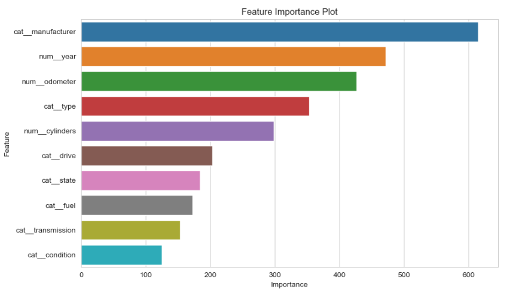

# Goal

The goal of this project is to determine if used car prices can be predicted and what attributes of the used cars will be the best indicators of the price of the car. This is an important factor for used car dealerships as the right pricing can determine how quickly the car can be sold and how much margin can be made on it. 

# Approach
The cars dataset has over 470,000 rows of past used car sales prices. There are 18 different features about the cars spanning the location of the dealership, attributes about the car make, and specific attributes about the actual cars. I first started with analyzing every attribute and any potential correlations, and as an outcome of this I ended up discarding several attributes.

# Data Understanding

There are a lot of missing values, and we need to determine best action for each of them
- Model - there are 29K different combinations, as much as the model makes a lot of sense for prediction, there is a lot of bad data in it which would be very tedious to correct; so best to use the model to impute other variables, but discard it in the end
- Manufacturer - We can try to fill manufacturer from model, because manufacturers do not use same model names as those of other manufacturers
- Year and model - From a buyers standpoint, these are the two most important factors, we will drop any rows without these fields, fortunately there are not a lot a rows missing these
- Condition (40% missing ) - We will populate "Good" into the missing values as we can expect a dealer to only buy inventory that is at least "Good"
- Cylinders (41% missing) - We will try to extrapolate this from the manufacturer, year and model
- Size (70% missing) - We cannot use this attribute and will discard it
- Vin - not needed as no customer would make a decision based on vin, we can drop this
- Fuel - we can extrapolate this from the manufacturer, year and model; and drop the rest of the rows that cant be extrapolated
- Odometer - we can fill with median
- Drive (30% missing) we can extrapolate this from the manufacturer, year and model
- Type (21% missing) this is an important attribute for customers buying cars, unfortunately its missing for 21% of the rows, we can try to extrapolate it from the manufacturer, year and model
- Paint color (30% missing) we cannot extrapolate this, it does play a role in a customer's decision, but without 30% of the data having this, we will have to drop this column

# Modeling

I trained several different models with different ML techniques:
1. Linear Regression
2. Rige
3. Lasso
4. Decision Trees
5. Gradient Boosted Trees
6. XgBoost
7. LGBM

I went out on a limb to try XgBoost and LightGBM (which is Microsoft's implementation of gradient boosting), and was pleasantly suprised by the great prediction performance of these ensemble models compared to the standard models. LightGBM had a R2 score on the testing dataset of 94%. 

I further performed hyperparameter tuning on the LightGBM model and was able to improve the performance of LGBM model to 96% R2 score. One of the unique things with the LGBM model was the fit speed and the learning rate, and it was clear that the model had a impressive loss reduction rate as the number of samples increased.

# Findings and Recommendations

Based on my modeling, I have found the following:
- The most important features for pricing are the manufacturer, the year and the odometer reading.
- The manufacturer is especially important because of the presence of high end used cars in the dataset used to model the data; they should create progressive pricing tiers based on the manufacturer.
- The year of manufacture is the second most important factor in the pricing of a used car, the newer the car, the more progressive the price can be
- The odometer reading is strongly correlated to the price for mid-market car brands not so much for the luxury brands
- The condition of the car generally is not a big factor because majority of the cars being sold have to meet minimum standards, and there is not a large variability in this attribute.
- There is not that much variance based on the state where the car is sold, the prices of used cars are fairly close regardless of the state where sold.

  
